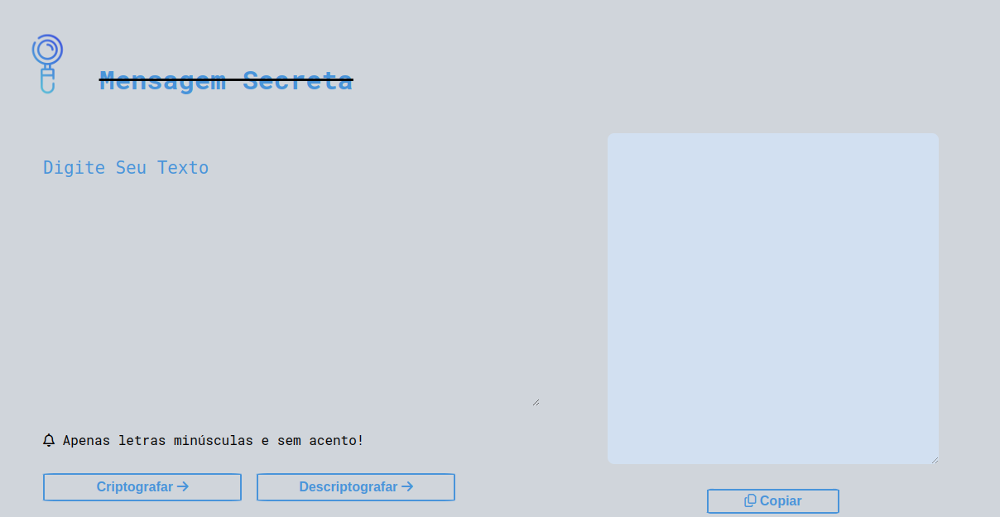

# mensagem-secreta-criptografia
## #challengeonedecodificador6

Oi 👋, Eu sou Dayane Rodrigues

- 🔭 Eu estou participando do programa da Oracle e Alura [#OracleNextEducation](https://www.oracle.com/br/education/oracle-next-education/)

- 🌱 Eu estou estudando front e back end **Java, JavaScript**

# Challenge da ONE de Decodificador com JavaScript

Uma página web que codifica, copia e decodifica uma mensagem, com o objetivo de praticar as tecnologias base do front-end e desenvolvido durante a formação iniciante em programação na Alura pelo programa Oracle Next Education 

## 🔨 Funcionalidades do projeto

O web site contém duas seções principais, uma que o usuário irá inserir a mensagem e quer criptografar ou descriptografar e outra seção onde será exibido o resultado dessas funcionalidades. Também há a possibilidade de copiar o conteúdo a partir butão de copiar.

## ✔️ Técnicas e tecnologias utilizadas

- `HTML`
- `CSS`
- `JavaScript`
  

## 📁 Veja o projeto

Basta entrar no [Link](https://dayanealrodrigues.github.io/mensagem-secreta-criptografia/) 
